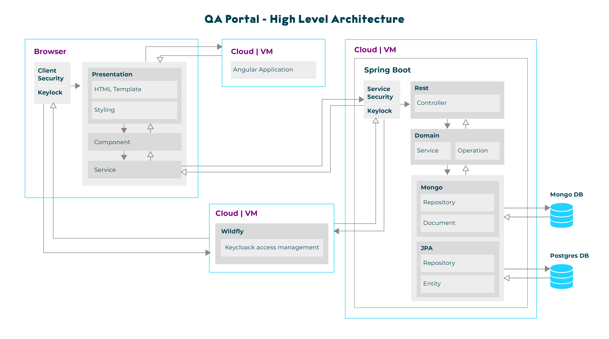
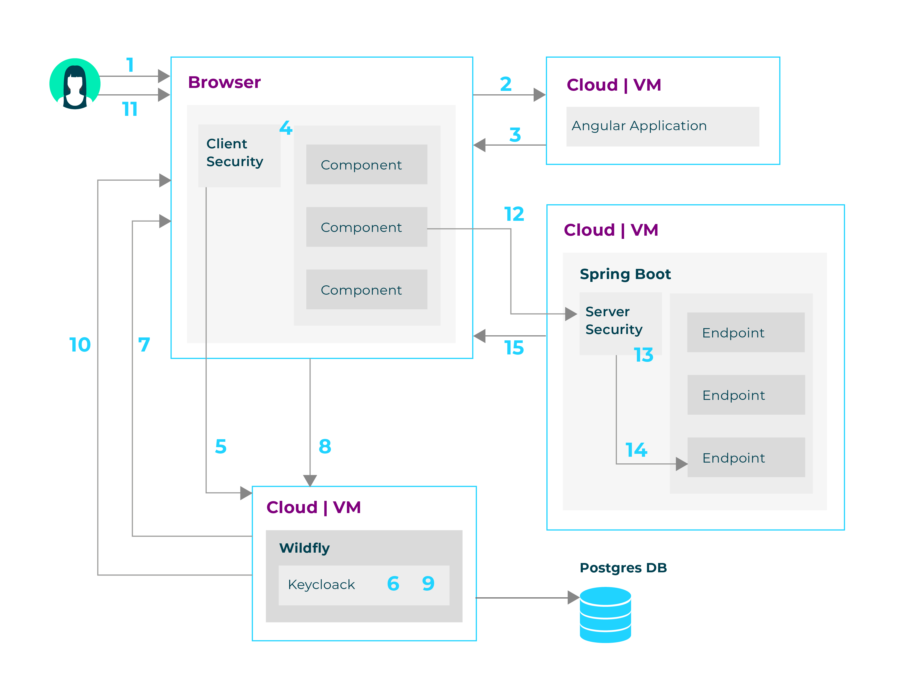
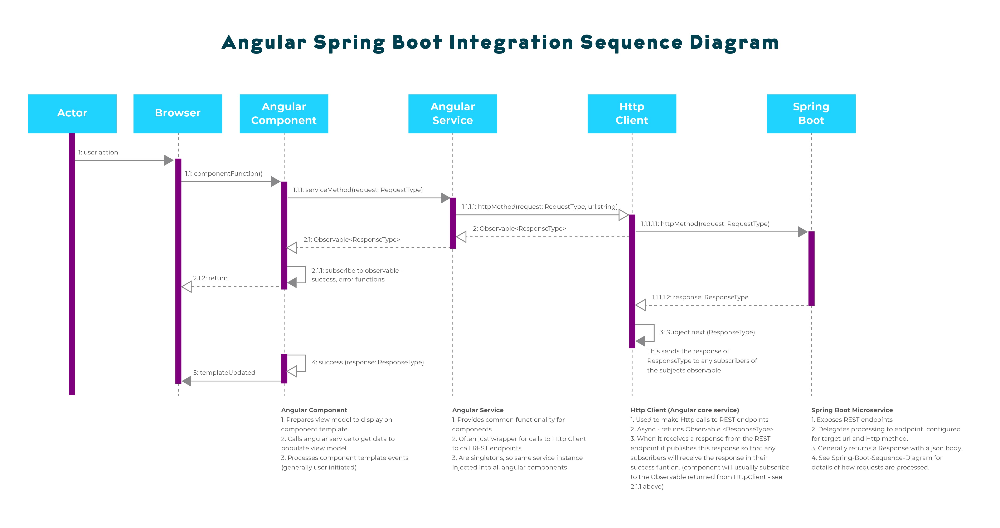

# QA Portal

The QA Portal architecture consists of the following components

-   [Spring Boot](https://docs.spring.io/spring-boot/docs/current/reference/html/) one spring boot application per microservice

-   [Angular 8](https://angular.io/docs) for client side user interfaces

-   [Postgres](https://www.postgresql.org/docs/11/index.html) for relational data.

-   [Mongo](https://docs.mongodb.com/) for document based non-relational data

-   [Keycloak](https://www.keycloak.org/archive/documentation-6.0.html) for authentication and access control

## Contents

**[1. Architecture](#architecture)**
- [High Level Architecture Diagram](#high-level-architecture-diagram)
- [Architecture Overview](#architecture-overview)
- [Keycloak Integration](#keycloak-integration)
- [Angular / Spring Boot Integration](#angular-spring-integration)

**[2. Developer Environment Setup](#developer-environment-setup)**

**[3. Source Control](#source-control)**
- [Assumptions](#assumptions)
- [Local Workspace Setup](#local-workspace-setup)
- [Portal Development](#portal-development)

## 1. Architecture

### 1.1. High Level Architecture Diagram

### 1.2. Architecture Overview

#### 1.2.1. Http Layer
The Http layer exposes the portals RESTful API to clients. Each endpoint is implemented as a method in a [Spring Boot Rest Controller](https://docs.spring.io/spring-boot/docs/current/reference/htmlsingle/#boot-features-spring-mvc), exposed through a Spring Boot application (microservice)

Each endpoints responsibility is to accept requests for a resource, delegate the processing of that request to a Domain Service component, and return the response from that Domain service wrapped in an Http Response to the client.

The Spring Boot framework utilises the Jackson JSON library to transform JSON requests from the client into data transfer objects (DTOs) that are passed to the Domain Service components.

#### 1.2.2. Service Layer
The Service layer provides the domain / business specific processing. Each service method called from a Spring Boot Rest Controller has the following responsibilities 
   - define the transaction boundary (by decorating the method with Springs @Transactional annotation)
   
   - accept a Data transfer object (or objects) from a Spring Boot Rest Controller
   
   - validate the Data transfer object (when required)
   
   - transform the Data transfer object to a JPA entity object (if using JPA entities)
   
   - retrieve data required for processing (from Database, File system or external services)
   
   - apply business / domain logic and apply updates to persistence objects (JPA entities, Mongo documents, etc)
   
   - create a data tranfer object representing the response to be sent back to the client
   
   - return this data transfer object to the calling Spring Boot Rest Controller

#### 1.2.3. Peristence Layer
In QA portal services there are 3 data stores being updated. 

##### 1.2.3.1. qa-portal database 

Postgres database for storage of the portal application data. Each spring boot application accessing or updating the qa-portal-database will do so through [Spring JPA Repositories](https://docs.spring.io/spring-data/jpa/docs/current/reference/html/#jpa.repositories) via [JPA entities](https://docs.oracle.com/cd/E16439_01/doc.1013/e13981/undejbs003.htm) 

##### 1.2.3.2. qa-portal-cv database

Mongo database for storage of CV versions created for trainees. This is accessed from spring boot applications through [Spring MongoDB Repositories](https://docs.spring.io/spring-data/mongodb/docs/1.2.0.RELEASE/reference/html/mongo.repositories.html) via [Spring Mongo documents](https://docs.spring.io/spring-data/mongodb/docs/current/reference/html/#reference)

##### 1.2.3.3. keycloak database

Postgres database for storage of the keycloak access management data. This is only accessed through Keycloaks admin client library classes, which is being used in the QA Portal to maintain users and roles for the application. This is only used within the Portal Management area of the QA Portal which can only be accessed by a QA Portal administrator.

### 1.3. Keycloak Integration

   - **Step 1**  - User requests a QA Portal Resource in the browser. 
   - **Step 2**  - Browser makes request for for QA Portal Resource. QA Portal Resource deployed as an angular application on the Cloud or on a VM. 
   - **Step 3**  - QA Portal resource returned to browser. 
   - **Step 4**  - QA Portal resource (angular application) loads in the browser (this includes the angular-keycloak adapter used for integrating the angular application with keycloak). This is "bootstrapped" into the angular application by an [angular application initializer function](qa-portal-angular/app-init.ts). 
   - **Step 5**  - Prior to accessing any angular application resources, the angular-keycloak adapter will verify that the user is authenticated. As user not authenticated, a service call is made to the keycloak server (running on a wildfly instance on the Cloud or a VM). 
   - **Step 6**  - Keycloak authentication service establishes this is an unauthenticated request, so establishes the URL of the keycloak login page associated with the keycloak realm providing the authentication for the QA Portal angular application. 
   - **Step 7**  - Keycloak service sends a redirect request to the browser for the QA Portal keycloak login page. 
   - **Step 8**  - Login page is displayed and the user enters their username and password. 
   - **Step 9**  - Login request sent to Keycloak Service to be authenticated. 
   - **Step 10** - User authenticated, JWT created by keycloak authentication service and sends redirect to the URL of the QA Portal resource originally requested in Step 1. 
   - **Step 11** - User invokes an action on a QA Portal angular component (e.g. button press), resulting in a call to an external REST service. 
   - **Step 12** - QA Portal angular portal component delegates external service call to an angular service class which in turn delegates the call to angulars HttpClient. The angular-keycloak adapter provides an Http Interceptor that intercepts any Http requests sent from HttpClient and adds an authorization header to the request containing the JWT for the user currently logged into the QA Portal application. 
   - **Step 13** - Prior to the request reaching the requested Spring Boot REST endpoint, the Spring-Keycloak adapter configured as part of the [Spring Boot applications web security](qa-portal-services/api-common/src/main/java/com/qa/portal/common/config/SecurityConfig.java) intercepts the request and validates the JWT supplied in the requests authorization header. The configuration for the keycloak server is defined in the keycloak.json file in the qa-portal-services/api-common/src/main/resources folder. **NOTE: keycloak.json and application.yml configurations for test and production environments should be external from the application and stored on a secure server**. 
   - **Step 14** - Once the JWT is verified to be valid, the request is forwarded to the requested endpoint. 
   - **Step 15** - The endpoint processes the request and sends the response back to the angular application running in the browser. 

### 1.4. Angular / Spring Boot Integration

## 2. Developer Environment Setup

   - Clone this repository into your local workspace. See instructions in the [Source Control](#source-control) section below for instructions. 
   
   - Set up Postgres, Keycloak and Mongo DB. See [Local development environment setup](qa-portal-infra/README.md) for instructions. 
   
   - Build and run the Spring Boot microservices. See [Build and run microservices](qa-portal-services/README.md#build-and-run-services) for instructions. 
   
   - Build and run the Angular client application. See [Build and run angular application](qa-portal-angular/README.md) for instructions. 

## 3. Source Control

Source code for the [QA Portal](https://github.com/DevQAC/QA-Portal) is managed in Github.

### 3.1. Assumptions

   - It is assumed you already have a Git account set up. If this is not the case, access http://www.github.com and register for an account

   - It is also assumed that you have Git installed on your development machine (either command line or through your IDE). If not, download and install a Git client (or Git plugin for your IDE)

### 3.2. Local Workspace Setup

#### 3.2.1. Clone the Git repository

Create a top level (workspace) folder to store the source code. From this folder run the following command

    git clone https://github.com/DevQAC/QA-Portal.git

#### 3.2.2. Pull the development branches

Pull the development branch into your local workspace as follows

    git fetch

    git checkout -t origin/development

### 3.3. Portal Development

When starting work on a new Jira task, for each repository that you will have to amend, create a local feature branch (i.e. if you need to change both qa-portal-angular and qa-portal-services repos then you'll need to create a local feature branch for each of them)

#### 3.3.1. Create local feature branch

Make sure you are in the development branch of the repository and get the latest changes by running the following commands

    cd {path to repo folder in your local workspace}
    
    git fetch

    git checkout development

    git pull

Create a new feature branch (name it by Jira Task number and title of change) as follows

    git branch feature/JIRA-XXXX-Task-title

Switch to the new branch

    git checkout feature/JIRA-XXXX-Task-title

Once you've created your local feature branch start making your changes to the feature branch(es). After you've made amendments to your code, it is advisable to push your local feature branch to the remote repo and create a pull request. This can be done as follows

#### 3.3.2. Push your local feature branch(es)

Repeat the following for each of your feature branches to push local branch to the remote repository

    git push origin feature/JIRA-XXXX-Task-title

#### 3.3.3. Create a Pull Request

   - Log in to Github

   - Navigate to the [repository branches page](https://github.com/DevQAC/QA-Portal/branches).

   - Select your feature branch

   - Press the 'New Pull Request' button

   - Leave the base as 'development'

   - Press the compare button and select your feature branch

   - Press the 'Create Pull Request' button.

#### 3.3.4. Complete development

Continue to develop your feature until you are happy that it is working and has been developed in accordance with the projects development guidelines, with unit and integration tests.

Ensure that your feature branch also contains the latest changes that have been merged into the development branch, and works with these changes. You can do this by merging the latest development branch code into your local feature branch. This is best done with your IDE as merging from the command line when there are conflicts can be cumbersome.

At this point, push the changes from your local branch to the branch in the remote repository and inform the development lead that your feature is ready for review.

#### 3.3.5. Pull Request Review

The development lead should then review your changes, ensure that there are no conflicts with the development branch, and that your work adheres to the project standards. 

If there are any issues, these should be documented on the Pull request and returned to the developer to address. The review cycle is then repeated.

#### 3.3.6. Approval and Merge

Once the development lead is happy that your changes are acceptable, they should approve the Pull request and merge the changes into the development branch. The feature branches should then be deleted from the repository and you should delete the feature branches from your local workspace.
