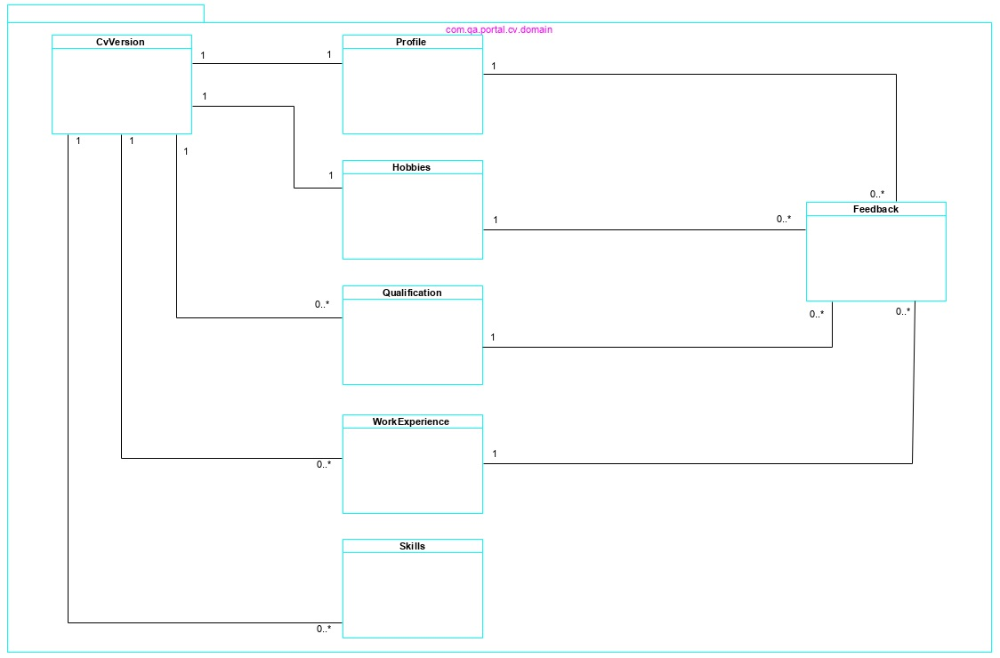

# QA Portal Services 

**[1. Overview](#overview)**

**[2. Developer Guide](#developer-guide)**
- [Common Library](#common-library)
- [QA Portal Spring Boot microservices](#spring-boot-microservices)
- [Adding a new Spring Boot project](#adding-spring-boot-project)
- [Developing a new Spring boot endpoint](#developing-spring-boot-endpoint)

**[3. Build and Run Services](#build-and-run-services)**
- [Pre-requisites](#pre-requisites)
- [Start microservices](#start-microservices)

## 1. Overview

The projects in this repository provide the business logic, service integration and persistence capabilities of the QA Portal application. The repository is structured as follows

   - A single library project (api-common) containing code to be used by all the QA Portal micro-service projects. This should reduce the time to develop new micro-service projects, maximise code reuse and encourage a consistent approach to developing these micro-service projects. 

   - Several Spring Boot micro-service projects that use the api-common library. Each micro-service project exposes the REST endpoints for a specific application domain. These micro-service projects should utilise the security, exception handling, persistence and mapper functionality provided by the common-api library. The REST endpoints will be accessed by the QA Portal angular client, but could be accessed from any client provided the client is configured with the appropriate keycloak security adapter. 

## 2. Developer Guide

### 2.1. Common Library

The api-common project should be used by all the QA Portal micro-service projects, and provides the following common functionality

#### 2.1.1. A security configuration and implementation (Keycloak)

Keycloak (https://www.keycloak.org/documentation.html) has been selected to provide the authentication mechanism for the QA Portal application. Keycloak is an identity and access management provider with client adapter libraries our applications can use to integrate with the Keycloak provider. For our Spring Boot micro-services this requires a Spring security configuration to integrate with keycloak. This is achieved as follows:

   - A keycloak spring security dependency in the pom.xml file of the api-common project (and each of the Spring Boot micro-service projects).

   - A keycloak implementation of Spring Security Config (in api-common project). This is provided by the com.qa.portal.common.config.SecurityConfig class. The KeyclockConfigResolver injected into SecurityConfig returns a keycloak.json file. 

   - A keycloak.json file added to the resources folder of each Spring Boot micro-service project. This specifies the configuration for the Keycloak adapter to connect to the Keycloak provider. 

This keycloak.json configuration can be obtained from the keycloak providers admin console as follows - 

   - Log into the keycloak admin console (http://localhost:8080/auth/admin/)

   - Select the qa-portal realm

   - In Clients option, select the qa-portal-services-core client

   - Select the Installation option (right most option)

   - Select Keycloak OIDC JSON format

   - The JSON configuration will be displayed.

   - Copy and paste this into the keycloak.json file in the resources file. 

#### 2.1.2. Standard Exception handling mechanism

Spring Boot provides an Exception Handling mechanism that separates the exception handling from our business code. In the api-common project the com.qa.portal.common.exception.QaPortalExceptionHandler class has been created to provide this central exception handling mechanism. There are 3 QA Portal Exceptions that should be thrown from our Spring Boot micro-services: 

   - QAPortalBusinessException - thrown if we encounter a business validation issue, or an error that is recoverable by user action within the application.

   - QaResourceNotFoundException - thrown if an entity (resource) is not found. **THIS SHOULD NOW BE DEPRECATED AND EVENTUALLY REMOVED**

   - QaPortalSevereException - thrown if the application encounters a serious error that user action could not resolve (e.g. Out of memory exception, cannot connect to external resource (database or service), etc). 

   - Any Runtime Exceptions will also be handled by the QAPortalExceptionHandler and will be treated by the client in the same way as a QAPortalSevereException.

The current QAPortalExceptionHandler implementation is very basic. The intention is to extend this to source messages from a file external to the application and the facility to insert contextual information into those messages.

#### 2.1.3. Optimistic Locking solution

Optimistic Locking is the standard solution solution for dealing with concurrent updates of database records. It doesn't have the performance impact of pessimistic locking and is simple to implement using JPA annotations.

The com.qa.portal.common.persistence.entity.QaBaseEntity is a mapped superclass (fancy way of saying a superclass of an Entity class that has persistence mappings but is not itself an Entity). This class has the following 3 properties, all of which are automatically set

   - last_updated_timestamp

   - last_updated_by

   - version

The version property is decorated with @Version which tells JPA providers that this is the column to use to track the version of the entity instance. Everything else is taken care of by the JPA provider. If an entity cannot be updated due to concurrent access, an OptimisticLockException will be thrown, which will be handled by the central QaPortalExceptionHandler, returning a message to the client advising them to retry the operation. 

Any entities created in the Spring Boot micro-service projects only have to extend this QaBaseEntity class in order to have optimistic locking automatically activated.

#### 2.1.4. Utility classes

Dozer provides a facility to map a source object into an object of a specified target class, by providing XML configuration or using Dozer annotations. For our services we are using the XML configuration mechanism.

A DozerBeanMapper is instantiated in the Spring Boot configuration class com.qa.portal.common.config.CoreConfig, and is injected into the com.qa.portal.common.service.mapper.BaseMapper class. This wraps the DozerBeanMapper class and provides a few convenience methods for mapping QaUserEntity and QaUserDto objects. This could be extended in the future. To support Dozer mappings there are also some custom converters provided in the com.qa.portal.common.util.mapper.converters package.

### 2.2. Spring Boot microservices

#### 2.2.1. Overview
portal-application-api and self-reflection-api are examples of QA Portal Spring Boot micro-service projects. These have a standard structure that all QA Portal Spring Boot projects should adhere to 

a) Spring Boot Application class placed in the com.qa.portal package. Spring Boot component scan will manage all beans that are at (or inside) the Spring Boot applications package. By placing the application class at the com.qa.portal package, all the beans from the api-common library will automatically be accessible from the micro-service application. 

b) Under the com.qa.portal.projname package, the following packages should be created

   - **config** - contains Spring Boot configuration classes for the instantiation of beans to be managed by Springs IOC container for this application (alternatively for classes that require no special initialisation, then decorating your class with @Component will have the same effect)

   - **dto** - data transfer objects passed across the wire from client to the service. Ideally these should be immutable (current micro-service projects have mutable DTOs)

   - **persistence** - when using JPA, separated into entity and repository subpackages. Each entity requiring optimistic locking, last_updated_timestamp and last_updated_by properties should extend QABaseEntity. Ensure that all relationships are modelled (i.e. we don't want entities with ids representing foreign keys).

   - **rest** - Spring Boot RestControllers added to this package. The controller classes should have no business or exception handling logic, instead just delegating to the service classes to carry out the business logic. Exceptions should be handled centrally by QaPortalExceptionHandler. 

   - **service** - all business logic and management of persistence objects (entities) are performed by the classes in this package. A service class provides the entry point to this business processing, and provides the transaction boundary for the operation. The service class method called from a RestController should be decorated with the @Transactional annotation. These classes do the the bulk of the processing so it's worth breaking service classes down if there are several operations being performed by the service. See the self-reflection-api services package for an example where Operation classes provide the main processing and various mapper classes provide the transformation between entity and DTO classes.

**NOTE: Entity classes should not leak outside the service classes (i.e. should never reference an Entity class in a DTO, or a Controller).**

c) Each Spring Boot micro-service project must have a dependency in their pom.xml to the api-common library, and the keycloak spring security adapter. By adding a keycloak.json file to the micro-service projects resources folder, keycloak authentication will automatically be activated for all endpoints.

d) Endpoints that are only to be accessible by the super-user role should adhere to the url format /manage/**. This ensures that only a user with the super-user role can access the endpoint.

**WARNING - All classes managed by Springs IOC container MUST be stateless (i.e. they cannot hold request specific (mutable) state. Immutable state available for the lifetime of the application is OK and can help performance when caching data).**  

#### 2.2.2. portal-application-api

##### 2.2.2.1. Overview

The portal-application-api project manages the resources that control what menu items and pages are available to a user in the portal, through role based access.  Each Portal page is associated with one or more roles, and only users with one or more of these roles can access these pages. Each page is a member of a Portal Project (E.g. Feedback, Reflection) which is used to group portal pages on the portal UI menu.  
The roles for a user are associated with a portal application, with the top level menu on the UI only showing the applications that the user has access to (e.g. Training). Each application (e.g. Training, HR) can have multiple roles (training-user, training-manager, training-admin), but a single user can have at most one role per portal application.  
Portal applications and the associated resources can only be managed by a user with the super-user role through the administration application.  
The portal-application-api manages the qa portal application database schema through the flyway library and scripts located in the src/main/resources/db/migration folder. Possible change for the future would be to move these into a database management project.  

##### 2.2.2.2. Class Diagram

##### 2.2.2.3. Rest Api

The portal-application-api projects REST api can be viewed at http://{server}:8081/portal-application-api/swagger-ui.html. If you are running the service locally then the API will be available at http://localhost:8081/portal-application-api/swagger-ui.html.  

#### 2.2.3. cohort-api

##### 2.2.3.1. Overview

The cohort-api manages all the resources associated with a cohort (cohort_course, course, trainer, trainee, technology, location). These resources are common across most of the spring boot services for the QA Portal, so are defined in the api-common project, but are managed through the cohort-api.  
When a user is created (or updated) both the QA Portal application database, and the keycloak database are updated. These updates are performed in separate transactions, so there is the potential for the QA Portal database and keycloak to get into an inconsistent state if an error occurs. At the moment, any of these inconsistencies will have to be resolved manually, but a task should be added to JIRA to investigate the feasibility of an automated solution.  
Currently cohorts, courses and technologies can be created and updated but there is no mechanism to delete them. If deletion is introduced in future, it should be a soft delete so associations with other resources (e.g. feedback forms) are preserved.  
Cohorts and the associated resources can only be managed by a user with the super-user role through the administration application, but they can be referenced by any of the other QA Portal services (through api-common). 

##### 2.2.3.2. Class Diagram

##### 2.2.3.3. Rest API

The cohort-api projects REST api can be viewed at http://{server}:8086/cohort-api/swagger-ui.html. If you are running the service locally then the API will be available at http://localhost:8086/cohort-api/swagger-ui.html.  

#### 2.2.4. cv-api

##### 2.2.4.1. Overview

The cv-api manages CV versions for Trainees. A CV version consists of a Trainee Profile, Hobbies, Work Experience, Qualifications and Skills. The skills section is auto populated from the technologies associated with the courses the trainee has completed as part of their training within a cohort. Other skills can also be manually added by the trainee. A trainee can create a new CV or update an existing CV that has not yet been approved by an admin user. Once a CV version has been approved by a training administrator, the CV version is stored, and any amendments have to be made as a new CV Version.  
The cv-api provides a facility to generate a PDF for the CV which can be viewed in a browser tab. Once a training administrator approves a CV version the generated PDF file is stored in a file system (at the moment this is expected to be one drive).  
A CV version can have the following states: 
   - **In Progress** - Trainee has created and saved the CV Version but has not submitted it for approval by a training administrator 
   - **For Review** - Trainee has submitted the CV Version for review but the training administrator has not yet reviewed the CV Version 
   - **Failed Review** - The training administrator has raised comment with the CV Version and the trainee has yet to address the comments and resubmit for review 
   - **Approved** - The training administrator has reviewed and approved the CV Version, the CV version has been stored to a file system (one drive), and the CV version is no longer editable 

##### 2.2.4.2. Class Diagram

##### 2.2.4.3. Rest Api

The cv-api projects REST api can be viewed at http://{server}:8087/cv-api/swagger-ui.html. If you are running the service locally then the API will be available at http://localhost:8087/cv-api/swagger-ui.html.  

#### 2.2.5. feedback-api

##### 2.2.5.1. Overview

The feedback-api manages trainee course evaluations and trainer course feedback. The trainee evaluation and trainer feedback form templates are created and managed by the form-api spring boot service. The feedback-api is responsible for managing instances of these forms created from the form templates and the responses provided to the questions within these form instances.  
The question  and category response classes are located in the api-common project as they can also be used by other spring boot projects (e.g. self-reflection-api), but the form specific information for the feedback and evaluation forms is defined within feedback-api. 

##### 2.2.5.2. Class Diagram

##### 2.2.5.3. Rest Api

The feedback-api projects REST api can be viewed at http://{server}:8084/feedback-api/swagger-ui.html. If you are running the service locally then the API will be available at http://localhost:8084/feedback-api/swagger-ui.html.  

#### 2.2.6. form-api

##### 2.2.6.1. Overview

The form-api is responsible for managing the structure of the various forms used within the QA Portal. Each form is broken down into a group of question categories and each of these categories is further divided into a number of questions. Only a user with a super-user role is allowed to manage the form templates through the Form Management component of the Portals Administration application.  
The resources managed by the form-api are defined in the api-common project as they are used across a number of the QA Portal spring boot services (e.g. feedback-api and self-reflection-api), but they are only created and updated through the form-api. 

##### 2.2.6.2. Class Diagram

##### 2.2.6.3. Rest Api

The form-api projects REST api can be viewed at http://{server}:8085/form-api/swagger-ui.html. If you are running the service locally then the API will be available at http://localhost:8085/form-api/swagger-ui.html.  

#### 2.2.7. self-reflection-api

##### 2.2.7.1. Overview

The self-reflection-api manages trainee self reflection forms and the reviews of those forms by a trainer. The self reflection form template is managed by the form-api spring boot service. The self-reflection-api is responsible for managing instances of these self reflection forms created from the form template and the responses provided to the questions within these form instances.  
The question response class (ReflectionQuestionEntity) is located in the self-reflection-api project, but a task has been raised in [JIRA](https://qacacademyred.atlassian.net/jira/software/projects/PG/boards/20) to refactor this code to use the same question and category response classes that are used in the feedback-api project. 

##### 2.2.7.2. Class Diagram

##### 2.2.7.3. Rest Api

The self-reflection-api projects REST api can be viewed at http://{server}:8082/self-reflection-api/swagger-ui.html. If you are running the service locally then the API will be available at http://localhost:8082/self-reflection-api/swagger-ui.html.  

### 2.3. Adding a new Spring Boot Project

a) Create (or copy existing) Spring boot maven project (Responsibility - Lead Dev)

b) In pom.xml add dependencies (Responsibility - Lead Dev)

   - keycloak spring security adapter

   - api-common

   - spring boot jpa

   - spring boot test

   - postgresql

c) Add spring boot maven plugin to pom.xml build plugins. (Responsibility - Lead Dev)

d) Add standard folder structure under com.qa.portal.projname (Responsibility - Lead Dev)

   - config

   - dto

   - persistence

   - persistence.entity

   - persistence.repository

   - rest 

   - service

   - service.mapper

   - util

e) Add ProjNameApplication java file under com.qa.portal  (Responsibility - Lead Dev)

f) Add ProjNameConstants java file under com.qa.portal.projname (Responsibility - Lead Dev)

g) Add keycloak.json file to resources folder  (Responsibility - Lead Dev)

h) Add configuration to application.yml file to resources folder  (Responsibility - Lead Dev)

i) Add dozer mapping file to resources folder  (Responsibility - Lead Dev)

j) Add new project as a module to the parent pom.xml in services folder  (Responsibility - Lead Dev)

k) Push to Git repo  (Responsibility - Lead Dev)
  
    

### 2.4. Developing a new Spring Boot Endpoint

a) Define REST interface (Responsibility - Lead Dev / Dev)

b) Define Persistence Model (Responsibility - Tech Lead / Dev)

c) Create or update DTOs in package com.qa.portal.projname.dto (Responsibility - Dev)

d) (Optional) Create Junits for new or updated DTOs (Responsibility - Dev)

e) Create or update entities in package com.qa.portal.projname.persistence.entity (Responsibility - Dev)

f) Create or update repository interfaces in package com.qa.portal.projname.persistence.repository (Responsibility -  Dev)

g) (Optional) Create Junits for (new or amended) entities (Responsibility - Dev)

h) Create or update mappers to map entities / DTOs (Responsibility - Dev)

i) Create Junit tests for (new or amended) mapper classes (Responsibility - Dev)

j) Create or update service class in package com.qa.portal.projname.service (Responsibility - Dev)

k) Create Junit tests for (new or amended) service class (Responsibility - Dev)

l) Create or amend RestController class in com.qa.portal.projname.rest package (Responsibility - Dev)

m) Create an Integration test to invoke RestController (Responsibility - Dev)

    

## 3. Build and Run Services

### 3.1. Pre-Requisites

a) A local keycloak instance and Postgres DB has been installed and configured as per instructions in [qa-portal-infra project](../qa-portal-infra/README.md)

### 3.2. Start microservices

a) Clone the qa-portal-services repo using command as per [QA-Portal](../README.md) instructions

b) From the base folder (qa-portal-services) build all the sub projects with maven

    mvn clean install

c) Start each of the following projects as Spring Boot applications

   - **portal-application-api** (this will populate postgres database with any flyway script updates) 
   - **cohort-api** 
   - **feedback-api** 
   - **form-api** 
   - **self-reflection-api** 
   - **cv-api** 

using the following command

    mvn spring-boot:run
