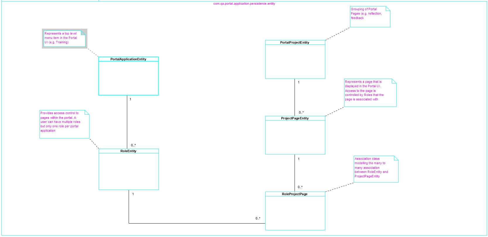
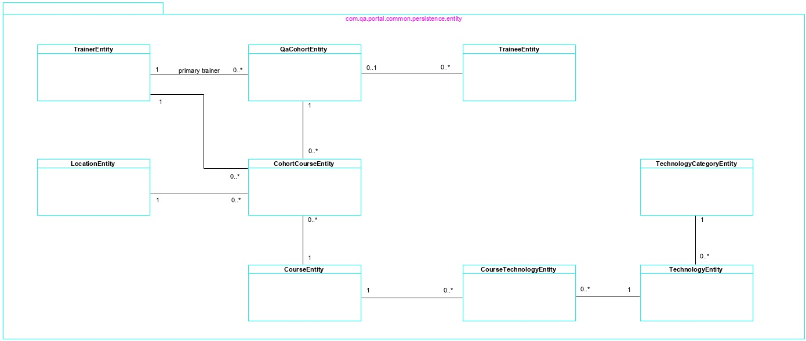

# QA Portal Services 

**[1. Overview](#overview)**

**[2. Developer Guide](#developer-guide)**
- [Common Library](#common-library)
- [QA Portal Spring Boot microservices](#spring-boot-microservices)
- [Adding a new Spring Boot project](#adding-spring-boot-project)
- [Developing a new Spring boot endpoint](#developing-spring-boot-endpoint)

**[3. Build and Run Services](#build-and-run-services)**
- [Pre-requisites](#pre-requisites)
- [Start microservices](#start-microservices)

## 1. Overview

The projects in this repository provide the business logic, service integration and persistence capabilities of the QA Portal application. The repository is structured as follows

a) A single library project (api-common) containing code to be used by all the QA Portal micro-service projects. This should reduce the time to develop new micro-service projects, maximise code reuse and encourage a consistent approach to developing these micro-service projects. 

b) Several Spring Boot micro-service projects that use the api-common library. Each micro-service project exposes the REST endpoints for a specific application domain. These micro-service projects should utilise the security, exception handling, persistence and mapper functionality provided by the common-api library. The REST endpoints will be accessed by the QA Portal angular client, but could be accessed from any client provided the client is configured with the appropriate keycloak security adapter. 

## 2. Developer Guide

### 2.1. Common Library

The api-common project should be used by all the QA Portal micro-service projects, and provides the following common functionality

#### 2.1.1. A security configuration and implementation (Keycloak)

Keycloak (https://www.keycloak.org/documentation.html) has been selected to provide the authentication mechanism for the QA Portal application. Keycloak is an identity and access management provider with client adapter libraries our applications can use to integrate with the Keycloak provider. For our Spring Boot micro-services this requires a Spring security configuration to integrate with keycloak. This is achieved as follows:

a) A keycloak spring security dependency in the pom.xml file of the api-common project (and each of the Spring Boot micro-service projects).

b) A keycloak implementation of Spring Security Config (in api-common project). This is provided by the com.qa.portal.common.config.SecurityConfig class. The KeyclockConfigResolver injected into SecurityConfig returns a keycloak.json file. 

c) A keycloak,json file added to the resources folder of each Spring Boot micro-service project. This specifies the configuration for the Keycloak adapter to connect to the Keycloak provider. 

This keycloak.json configuration can be obtained from the keycloak providers admin console as follows - 

i) Log into the keycloak admin console (http://localhost:8080/auth/admin/)

ii) Select the qa-portal realm

iii) In Clients option, select the qa-portal-services-core client

iv) Select the Installation option (right most option)

v) Select Keycloak OIDC JSON format

vi) The JSON configuration will be displayed.

vii) Copy and paste this into the keycloak.json file in the resources file. 

#### 2.1.2. Standard Exception handling mechanism

Spring Boot provides an Exception Handling mechanism that separates the exception handling from our business code. In the api-common project the com.qa.portal.common.exception.QaPortalExceptionHandler class has been created to provide this central exception handling mechanism. There are 3 QA Portal Exceptions that should be thrown from our Spring Boot micro-services: 

QAPortalBusinessException - thrown if we encounter a business validation issue, or an error that is recoverable by user action within the application.

QaResourceNotFoundException - thrown if an entity (resource) is not found. 

QaPortalSevereException - thrown if the application encounters a serious error that user action could not resolve (e.g. Out of memory exception, cannot connect to external resource (database or service), etc). 

Any Runtime Exceptions will also be handled by the QAPortalExceptionHandler and will be treated by the client in the same way as a QAPortalSevereException.

The current QAPortalExceptionHandler implementation is very basic. The intention is to extend this to source messages from a file external to the application and the facility to insert contextual information into those messages.

#### 2.1.3. Optimistic Locking solution

Optimistic Locking is the standard solution solution for dealing with concurrent updates of database records. It doesn't have the performance impact of pessimistic locking and is simple to implement using JPA annotations.

The com.qa.portal.common.persistence.entity.QaBaseEntity is a mapped superclass (fancy way of saying a superclass of an Entity class that has persistence mappings but is not itself an Entity). This class has the following 3 properties, all of which are automatically set

last_updated_timestamp

last_updated_by

version

The version property is decorated with @Version which tells JPA providers that this is the column to use to track the version of the entity instance. Everything else is taken care of by the JPA provider. If an entity cannot be updated due to concurrent access, an OptimisticLockException will be thrown, which will be handled by the central QaPortalExceptionHandler, returning a message to the client advising them to retry the operation. 

Any entities created in the Spring Boot micro-service projects only have to extend this QaBaseEntity class in order to have optimistic locking automatically activated.

#### 2.1.4. Utility classes

Dozer provides a facility to map a source object into an object of a specified target class, by providing XML configuration or using Dozer annotations. For our services we are using the XML configuration mechanism.

A DozerBeanMapper is instantiated in the Spring Boot configuration class com.qa.portal.common.config.CoreConfig, and is injected into the com.qa.portal.common.service.mapper.BaseMapper class. This wraps the DozerBeanMapper class and provides a few convenience methods for mapping QaUserEntity and QaUserDto objects. This could be extended in the future. To support Dozer mappings there are also some custom converters provided in the com.qa.portal.common.util.mapper.converters package.

### 2.2. Spring Boot microservices

#### 2.2.1. Overview
portal-application-api and self-reflection-api are examples of QA Portal Spring Boot micro-service projects. These have a standard structure that all QA Portal Spring Boot projects should adhere to 

a) Spring Boot Application class placed in the com.qa.portal package. Spring Boot component scan will manage all beans that are at (or inside) the Spring Boot applications package. By placing the application class at the com.qa.portal package, all the beans from the api-common library will automatically be accessible from the micro-service application. 

b) Under the com.qa.portal.projname package, the following packages should be created

**config** - contains Spring Boot configuration classes for the instantiation of beans to be managed by Springs IOC container for this application (alternatively for classes that require no special initialisation, then decorating your class with @Component will have the same effect)

**dto** - data transfer objects passed across the wire from client to the service. Ideally these should be immutable (current micro-service projects have mutable DTOs)

**persistence** - when using JPA, separated into entity and repository subpackages. Each entity requiring optimistic locking, last_updated_timestamp and last_updated_by properties should extend QABaseEntity. Ensure that all relationships are modelled (i.e. we don't want entities with ids representing foreign keys).

**rest** - Spring Boot RestControllers added to this package. The controller classes should have no business or exception handling logic, instead just delegating to the service classes to carry out the business logic. Exceptions should be handled centrally by QaPortalExceptionHandler. 

**service** - all business logic and management of persistence objects (entities) are performed by the classes in this package. A service class provides the entry point to this business processing, and provides the transaction boundary for the operation. The service class method called from a RestController should be decorated with the @Transactional annotation. These classes do the the bulk of the processing so it's worth breaking service classes down if there are several operations being performed by the service. See the self-reflection-api services package for an example where Operation classes provide the main processing and various mapper classes provide the transformation between entity and DTO classes.

**NOTE: Entity classes should not leak outside the service classes (i.e. should never reference an Entity class in a DTO, or a Controller.)**

c) Each Spring Boot micro-service project must have a dependency in their pom.xml to the api-common library, and the keycloak spring security adapter. By adding a keycloak.json file to the micro-service projects resources folder, keycloak authentication will automatically be activated for all endpoints.

**WARNING - All classes managed by Springs IOC container MUST be stateless (i.e. they cannot hold request specific (mutable) state. Immutable state available for the lifetime of the application is OK and can help performance when caching data).**

#### 2.2.2. portal-application-api

##### 2.2.2.1. Overview

##### 2.2.2.2. Class Diagram

##### 2.2.2.3. Rest Api

The portal-application-api projects REST api can be viewed at http://{server}:8081/portal-application-api/swagger-ui.html. If you are running the service locally then the API will be available at http://localhost:8081/portal-application-api/swagger-ui.html.

#### 2.2.3. cohort-api

##### 2.2.3.1. Overview

##### 2.2.3.2. Class Diagram

##### 2.2.3.3. Rest API

The cohort-api projects REST api can be viewed at http://{server}:8086/cohort-api/swagger-ui.html. If you are running the service locally then the API will be available at http://localhost:8086/cohort-api/swagger-ui.html.

#### 2.2.4. cv-api

##### 2.2.4.1. Overview

##### 2.2.4.2. Class Diagram

##### 2.2.4.3. Rest Api

The cv-api projects REST api can be viewed at http://{server}:8087/cv-api/swagger-ui.html. If you are running the service locally then the API will be available at http://localhost:8087/cv-api/swagger-ui.html.

#### 2.2.5. feedback-api

##### 2.2.5.1. Overview

##### 2.2.5.2. Class Diagram

##### 2.2.5.3. Rest Api

The feedback-api projects REST api can be viewed at http://{server}:8084/feedback-api/swagger-ui.html. If you are running the service locally then the API will be available at http://localhost:8084/feedback-api/swagger-ui.html.

#### 2.2.6. form-api

##### 2.2.6.1. Overview

##### 2.2.6.2. Class Diagram

##### 2.2.6.3. Rest Api

The form-api projects REST api can be viewed at http://{server}:8085/form-api/swagger-ui.html. If you are running the service locally then the API will be available at http://localhost:8085/form-api/swagger-ui.html.

#### 2.2.7. self-reflection-api

##### 2.2.7.1. Overview

##### 2.2.7.2. Class Diagram

##### 2.2.7.3. Rest Api

The self-reflection-api projects REST api can be viewed at http://{server}:8082/self-reflection-api/swagger-ui.html. If you are running the service locally then the API will be available at http://localhost:8082/self-reflection-api/swagger-ui.html.

### 2.3. Adding a new Spring Boot Project

1. Create (or copy existing) Spring boot maven project (Responsibility - Lead Dev)

2. In pom.xml add dependencies (Responsibility - Lead Dev)

   keycloak spring security adapter

   api-common

   spring boot jpa

   spring boot test

   postgresql

3. Add spring boot maven plugin to pom.xml build plugins. (Responsibility - Lead Dev)

4. Add standard folder structure under com.qa.portal.projname (Responsibility - Lead Dev)

   config

   dto

   persistence

   persistence.entity

   persistence.repository

   rest 

   service

   service.mapper

   util

5. Add ProjNameApplication java file under com.qa.portal  (Responsibility - Lead Dev)

6. Add ProjNameConstants java file under com.qa.portal.projname (Responsibility - Lead Dev)

7. Add keycloak.json file to resources folder  (Responsibility - Lead Dev)

8. Add configuration to application.yml file to resources folder  (Responsibility - Lead Dev)

9. Add dozer mapping file to resources folder  (Responsibility - Lead Dev)

10. Add new project as a module to the parent pom.xml in services folder  (Responsibility - Lead Dev)

11. Push to Git repo  (Responsibility - Lead Dev)

    

### 2.4. Developing a new Spring Boot Endpoint

1. Define REST interface (Responsibility - Lead Dev / Dev)

2. Define Persistence Model (Responsibility - Tech Lead / Dev)

3. Create or update DTOs in package com.qa.portal.projname.dto (Responsibility - Dev)

4. (Optional) Create Junits for new or updated DTOs (Responsibility - Dev)

5. Create or update entities in package com.qa.portal.projname.persistence.entity (Responsibility - Dev)

6. Create or update repository interfaces in package com.qa.portal.projname.persistence.repository (Responsibility -  Dev)

7. (Optional) Create Junits for (new or amended) entities (Responsibility - Dev)

8. Create or update mappers to map entities / DTOs (Responsibility - Dev)

9. Create Junit tests for (new or amended) mapper classes (Responsibility - Dev)

10. Create or update service class in package com.qa.portal.projname.service (Responsibility - Dev)

11. Create Junit tests for (new or amended) service class (Responsibility - Dev)

12. Create or amend RestController class in com.qa.portal.projname.rest package (Responsibility - Dev)

13. Create an Integration test to invoke RestController (Responsibility - Dev)

    

## 3. Build and Run Services

### 3.1. Pre-Requisites

a) A local keycloak instance and Postgres DB has been installed and configured as per instructions in [qa-portal-infra project](../qa-portal-infra/README.md)

### 3.2. Start microservices

a) Clone the qa-portal-services repo using command as per [QA-Portal](../README.md) instructions

b) From the base folder (qa-portal-services) build all the sub projects with maven

mvn clean install

c) Start each of the following projects as Spring Boot applications

portal-application-api (this will populate postgres database with any flyway script updates) 
cohort-api 
feedback-api 
form-api 
self-reflection-api 
cv-api 

using the following command

mvn spring-boot:run
